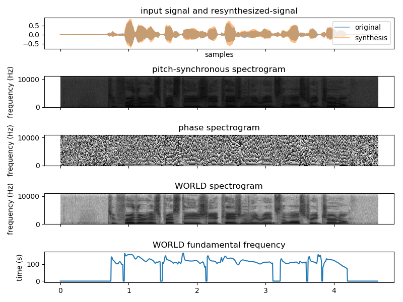
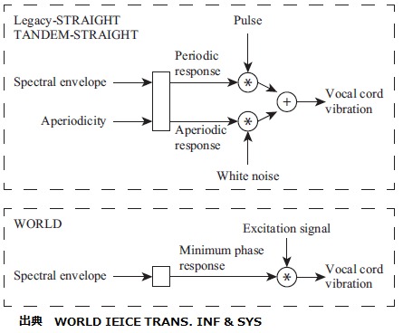

# 音声分析変換合成システムWORLDのPythonをWin10で動かす

## 概要  

音声分析変換合成システム[WORLD](http://www.kki.yamanashi.ac.jp/~mmorise/world/)の
Pythonの実装 [Python-WORLD](https://github.com/tuanad121/Python-WORLD)を
Windows10環境でも動くように変更した。 

[github repository](https://github.com/shun60s/Python-WORLD-Win10)  


## 使い方  

入力をencodeして、また decodeする。どこまでそんしょくなく元に戻るかを聞き比べる。  
```
python test1.py -i xxxx.wav -m harvest --not_requiem
```
入力ファイルの名前に方式と-resynthが追加された出力のWAVファイルができる。  
  
引数の説明  
- -i 入力のWAVファイルを指定する。未指定の場合、デフォルトの値はtest-mwm.wavになる。
- -m F0の推定の方式を選択する。harvest 又は dio　未指定の場合、デフォルトの値はharvestになる。dioは早いが、質はharvestよりわるい。
- --not_requiem 波形生成方式の選択。 未指定の場合、新しい（より質のよい）方式(d4cRequiem, synthesisRequiem)、--not_requiemを追加した場合は、従来の方式（d4c,synthesis)を使う。  

  

  

ピッチの高低、話す速さ、スペクトラムの伸縮などを変化させたものを作成する。  
```
python test2.py -i xxxx.wav -s pitch_scaling  -f 1.5 
```
入力ファイルの名前に方式とファクターに-resynthが追加された出力のWAVファイルができる。  
  
引数の説明  
- -i 入力のWAVファイルを指定する。未指定の場合、デフォルトの値はtest-mwm.wavになる。
- -s 変化させる項目を指定する。pitch_scaling(ピッチの高低） duration_scaling（話す速さ） spectrum_warp（スペクトラムの伸縮）　未指定の場合、デフォルトの値はpitch_scalingになる。
- -f 変化の度合いを示すスケールファクターを指定する。未指定の場合、デフォルトの値は1.5になる。
- --use_saved_npyを追加した場合は、以前encodeしてnpyデータとして保存したdatを使って計算する。


### 動作を理解するための図説  


話す速さの変化は下図様なtemporal positionの間隔を変えているようだ。  
   


励振源は、古典的な（周期的な）パルス源とノイズ源とを分けて構成するものではなく、  
入力信号のスペクトルをピッチ同期で求めた周波数特性で割ったを使っているようである。  
   
励振源とスペクトルとは完全に独立ではないようだ。  


## 主な変更点  

- 高速化の処理の部分を止める。遅くても動けばよしとした。
- メインプログラムのtest.pyとWORLDのClassモジュールを同じ階層にした。
- 必要なモジュール(numpy,scipy,matplotlibなど）はpipを使って個々にインストールする前提とした。
- 動作中の処理状態が分かるように、表示文(print文)を入れた。


## 動作環境  

- python 3.6.4 (64bit) on win32  （注意）Python-WORLDはPython 3.0以上をサポート
- windows 10 (64bit)
- numpy (1.14.0)
- scipy (1.0.0)
- matplotlib (2.1.1)


## 参照したもの  

- [音声分析変換合成システムWORLD](http://www.kki.yamanashi.ac.jp/~mmorise/world/)
- [WORLD github repository](https://github.com/mmorise/World)
- [Python-WORLD](https://github.com/tuanad121/Python-WORLD)

### WAVファイルの出典  

test-mwm.wav　外国語の発声はPython-WORLDのtestから。  
vaiueo2d.wav　発声「あいうえお」はWORLDのworld-0.2.3_matlabから。  


## ライセンス  
docsディレクトリーの中にある以下のオリジナルのライセンス文を参照のこと。   
LICENSE_Python-WORLD-master.txt  
LICENSE-WORLD.txt  

